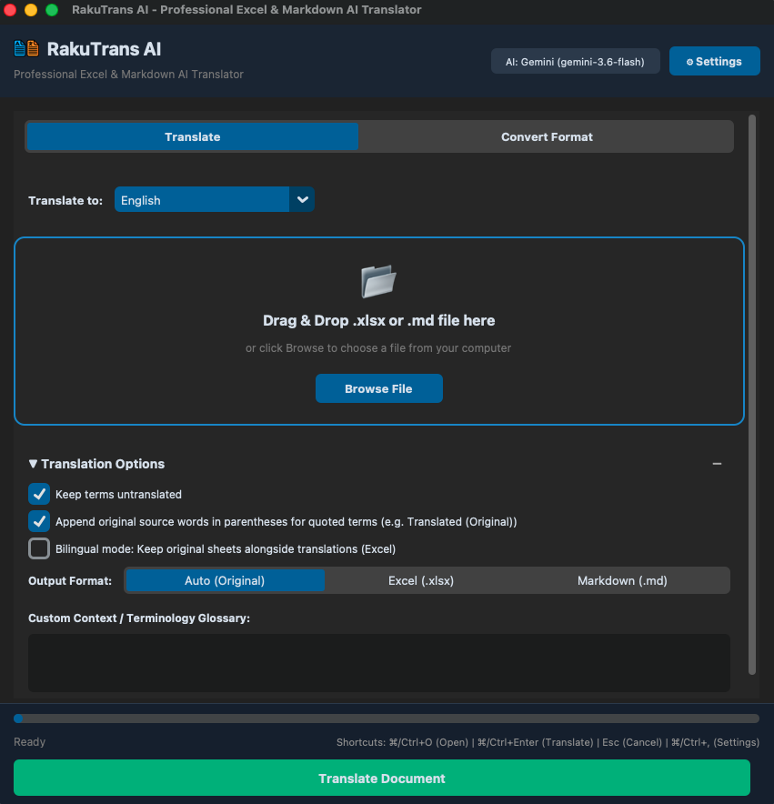

# RakuTrans AI

[English](README.md) | [日本語](README.ja.md) | [Tiếng Việt](README.vi.md)

Ứng dụng Desktop & CLI dịch thuật bằng AI hỗ trợ đa định dạng: **Excel (`.xlsx`)**, **Word (`.docx`)**, **PowerPoint (`.pptx`)**, **CSV/TSV (`.csv`, `.tsv`)**, **JSON (`.json`)**, **Plain Text (`.txt`)** và **Markdown (`.md`)**. Tối ưu hóa đặc biệt cho tiếng Nhật, tiếng Anh và tiếng Việt.

<p align="center">
  
</p>

---

## Tính năng nổi bật

- **Dịch thuật AI thông minh (Tự nhận diện ngôn ngữ gốc)**: Tự động nhận diện tài liệu ngôn ngữ hỗn hợp; người dùng chỉ cần chọn ngôn ngữ đích.
  - **Excel & CSV/TSV**: Giữ nguyên 100% công thức (`=SUM(...)`, `=IF(...)`), định dạng ô, màu sắc, đường viền và cấu trúc sheet/bảng.
  - **Word & PowerPoint**: Giữ nguyên bố cục trang, slide, kiểu chữ, danh sách và bảng biểu.
  - **JSON**: Dành cho lập trình viên & i18n, chỉ dịch chuỗi giá trị (values), bảo toàn khóa (keys) và biến định dạng (`{var}`, `%s`).
  - **Markdown & Plain Text**: Bảo toàn khối mã (```` ``` ````), inline code, tiêu đề, liên kết và bảng biểu.
- **Bộ nhớ dịch thuật (Cache SQLite cục bộ)**: Lưu trữ các đoạn đã dịch tại `~/.rakutrans/cache.db`, tránh gọi lặp lại API, tiết kiệm chi phí và tăng tốc độ.
- **Chuyển đổi định dạng Offline (Không cần API Key)**: Chuyển đổi 2 chiều trực tiếp giữa Excel (`.xlsx`) ⇄ Markdown (`.md`).
- **Tích hợp đa nền tảng AI**: Hỗ trợ Google Gemini, OpenAI, Anthropic Claude; tự động quét danh sách model thực tế từ API.
- **Giao diện Desktop hiện đại**: CustomTkinter với Dark/Light mode, đa ngôn ngữ (Việt, Nhật, Anh), kéo thả file, kiểm tra trước dữ liệu và hệ thống phím tắt tiện lợi (`⌘/Ctrl+O`, `⌘/Ctrl+Enter`, `Esc`, `⌘/Ctrl+,`).

---

## Công nghệ sử dụng (Tech Stack)

- **Ngôn ngữ nền tảng**: Python 3.10+
- **Giao diện (GUI)**: CustomTkinter, TkinterDnD2
- **Xử lý tài liệu**: OpenPyXL (Excel), python-docx (Word), python-pptx (PowerPoint), MarkItDown & Python-Markdown (Markdown)
- **Nền tảng AI**: Google GenAI (`google-genai`), OpenAI (`openai`), Anthropic Claude (`anthropic`)
- **Lưu trữ & Cache**: SQLite3 (Bộ nhớ dịch thuật), JSON (Cấu hình & Cache model)
- **Đóng gói ứng dụng**: PyInstaller

---

## Cài đặt & Sử dụng nhanh

### Cài đặt

```bash
git clone https://github.com/phunglb-pivot/rakutrans.git
cd rakutrans
pip install -r requirements.txt
```

### Chạy giao diện Desktop

```bash
./run.sh
# hoặc: python3 main.py
```

### Sử dụng qua dòng lệnh (CLI)

```bash
# Dịch file Excel sang tiếng Việt
python3 main.py --cli --file document.xlsx --tgt Vietnamese

# Dịch và chuyển đổi thẳng file Excel sang Markdown
python3 main.py --cli --file document.xlsx --tgt Vietnamese --output-format md
```

#### Bảng tham số CLI

| Tham số | Dạng ngắn | Mặc định | Mô tả |
| :--- | :--- | :--- | :--- |
| `--cli` | | `False` | Chạy ở chế độ dòng lệnh (CLI) |
| `--file` | `-f` | *Không* | Đường dẫn tệp `.xlsx` hoặc `.md` (bắt buộc khi dùng CLI) |
| `--tgt` | `-t` | `Vietnamese` | Ngôn ngữ dịch đích (`Vietnamese`, `English`, `Japanese`...) |
| `--src` | `-s` | `None` | Lọc ngôn ngữ gốc (mặc định: tự động nhận diện) |
| `--keep-terms` | `--keep-it` | `True` | Giữ nguyên thuật ngữ chuyên ngành/CNTT |
| `--append-source` | | `False` | Mở ngoặc đính kèm từ gốc |
| `--context` | `-c` | `""` | Ngữ cảnh hoặc bảng thuật ngữ tùy chỉnh |
| `--model` | `-m` | *Đã cấu hình* | Tên model AI (ví dụ: `gemini-3.6-flash`, `gpt-4o-mini`) |
| `--provider` | `-p` | *Đã cấu hình* | Nhà cung cấp AI (`Gemini`, `OpenAI`, `Claude`) |
| `--output-format` | `-out-fmt` | `auto` | Định dạng tệp xuất (`auto`, `xlsx`, `md`) |

---

## Đóng gói ứng dụng độc lập

Tạo file chạy trực tiếp không cần cài đặt Python:

- **macOS (`.app` & `.dmg`)**: `./build_macos.sh`
- **Windows (`.exe`)**: `build_windows.bat`

---

## Giấy phép (License)

MIT License
